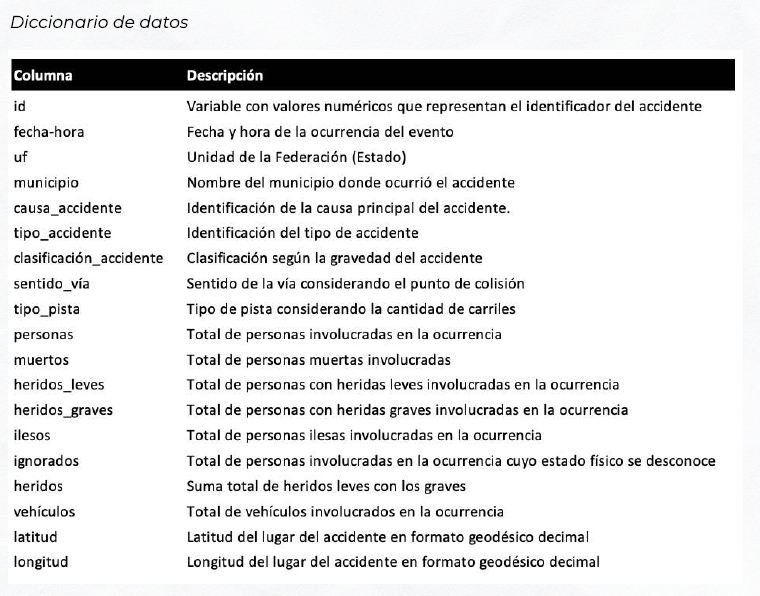

# BUSINESS CASE - ACCIDENTES EN CARRETERAS

Especializada en soluciones logísticas, **MasterLogistics** es una de las mayores
empresas en el sector en el país y actualmente busca expandir su área de
operación a la región sudeste.


La alta dirección solicitó al equipo de seguridad que realice un estudio de las
principales rutas de transporte por carretera en la región. La investigación inicial
concluyó que las **zonas con mayor concentración de accidentes son las
carreteras federales.**


A partir de esta primera evaluación, la empresa determinó que el área de
Analytics desarrolle un panel de control (dashboard) para profundizar en los
análisis. Usted, como miembro del equipo, recibió el **siguiente correo
electrónico:**


```
Estimado Analista,


Para este proyecto de expansión, necesitamos un estudio detallado sobre los
registros de accidentes en carreteras federales. Será necesario desarrollar un
Dashboard que contenga información correspondiente a los años 2018, 2019 y
2020.

En una reunión con el área estratégica de la empresa, identificamos puntos
esenciales:

- Cuantificar el total de eventos ocurridos, con vistas por horas, días de la
semana y estación del año.
- Recopilar la cantidad de fallecidos y heridos.
- Crear un mapa con la geolocalización de los eventos.
- Evaluar cuáles son las "Top 7" causas de accidentes.
- Cuantificar las ocasiones en las que un solo accidente registra más de 3 víctimas.

Es de extrema importancia que toda la información esté contemplada en una
única pestaña del Dashboard y que también sea posible filtrar por meses, años y
por la clasificación definida para cada incidente.

Siéntase libre de proponer nuevos análisis.

Atentamente,

Dirección
```


